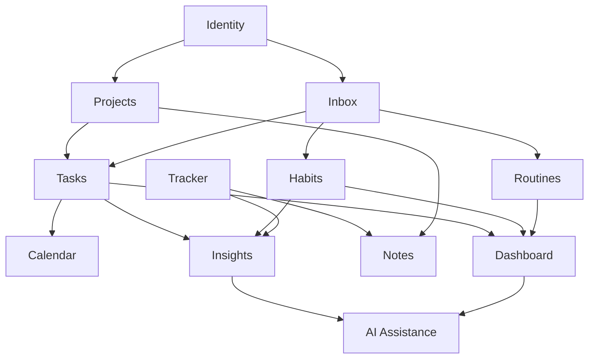

# TaskForge — Product Vision and Roadmap

> **Português (Brasil):** [PRODUCT_ROADMAP.pt-BR.md](PRODUCT_ROADMAP.pt-BR.md)

---

## 1. Product purpose

TaskForge is a **modular personal organization platform** built to centralize everyday demands with low friction and reduce the mental load of maintaining a productivity system.

It is **not** a generic tool that requires constant configuration. The central proposition:

> enough flexibility to track real life, enough structure to avoid excessive manual maintenance.

Over time it should evolve into a **personal operating system for everyday organization**.

---

## 2. Principles

### 2.1 Low friction

Creating a task, logging a habit, or adding information should take seconds.

Future example:

```text
Ctrl + K
→ type "buy cat litter"
→ Enter
```

The item enters the inbox and can be categorized later.

### 2.2 Capture first, organize later

Quick capture must not require immediate choices for project, priority, due date, category, tags, energy level, or estimated duration. **Only the title is mandatory.**

### 2.3 Register information once

A task with a due date should automatically appear in its project, the general task list, the calendar, the Today screen, and overdue lists when applicable — without manual duplication.

### 2.4 Satisfying visual progress

The system should leverage the satisfaction of lists and checklists. Completed items remain visually distinct and feed simple progress indicators.

### 2.5 Usable on low-energy days

Future reduced views will highlight essentials, quick tasks, minimum routines, items that fit available time, and items compatible with low energy.

### 2.6 Preserved history

Even before analytics modules exist, the backend must preserve timestamps and relevant historical data from the start to enable future personal pattern analysis.

---

## 3. Modular monolith approach

TaskForge will initially be developed as a **modular monolith**:

- one application, one deploy, one database initially;
- modules separated by responsibility;
- low coupling between system areas;
- incremental evolution;
- lower operational complexity than microservices.

Microservices are **not** a current goal. Modular separation allows domains to evolve without premature distributed complexity.

### Conceptual future structure

```text
TaskForge
├── Identity
├── Projects
├── Tasks
├── Inbox
├── Habits
├── Routines
├── Tracker
├── Lists
├── Calendar
├── Notes
├── Dashboard
├── Insights
└── AI Assistance
```

### Current physical repository structure

```text
TaskForge/
├── TaskForge.Domain/
├── TaskForge.Application/
├── TaskForge.Infrastructure/
├── TaskForge.Api/
├── TaskForge.Tests/
├── docs/
├── Dockerfile
├── docker-compose.yml
└── .env.example
```

Only **Identity** (in Infrastructure), **Projects**, and partial infrastructure are present in code today. Future modules have no implementation folders yet.

---

## 4. Planned modules

### 4.1 Identity

| Field | Detail |
|-------|--------|
| **Goal** | Manage identity, authentication, and personal data isolation |
| **Responsibilities** | Registration, login, JWT auth, current user identification, resource ownership authorization, future personal preferences |
| **Examples** | Register with email, login, access protected endpoints with Bearer token |
| **Relations** | Foundation for all other modules; every resource is scoped to a user |
| **Current MVP** | Included |
| **Implementation status** | Partially implemented — auth works; ownership not enforced in handlers |
| **Future analytics data** | Login timestamps, session patterns (when tracked) |

---

### 4.2 Projects

| Field | Detail |
|-------|--------|
| **Goal** | Containers for larger organizational efforts |
| **Examples** | "SENAI Application", "TaskForge", "Home organization", "Studies" |
| **Responsibilities** | CRUD, archive, delete, organize tasks, associate notes/links, track progress, enable modules as needed |
| **Relations** | Parent of Tasks; linked by Notes, Dashboard, Insights |
| **Current MVP** | Included |
| **Implementation status** | Partially implemented — CRUD without `OwnerId` or user scoping |
| **Future analytics data** | Created/updated timestamps, stall duration, completion rates |

---

### 4.3 Tasks

| Field | Detail |
|-------|--------|
| **Goal** | Manage actionable items that must be completed |
| **Examples** | "Buy shower resistor", "Finish README", "Send documentation", "Book appointment" |
| **Responsibilities** | Create, update, status, priority, due date, complete, reopen, delete, link to project, record timestamps |
| **Relations** | Child of Projects; feeds Calendar, Dashboard, Inbox (when converted), Insights |
| **Current MVP** | Included (reduced scope) |
| **Implementation status** | Not started |
| **Future analytics data** | Status transitions, `CompletedAt`, due date adherence, priority distribution, deferral patterns |

Future fields:

```text
TaskItem
├── Id, OwnerId, ProjectId?, Title, Description?
├── Status, Priority, DueDate?, EstimatedMinutes?, EnergyLevel?
├── CreatedAt, UpdatedAt?, CompletedAt?
```

---

### 4.4 Inbox

| Field | Detail |
|-------|--------|
| **Goal** | Quick capture without immediate categorization |
| **Flow** | Add quickly → store in Inbox → organize later |
| **Later actions** | Complete, delete, schedule, move to project, convert to task/habit/routine |
| **Relations** | Feeds Projects, Tasks, Habits, Routines |
| **Current MVP** | Not included |
| **Implementation status** | Planned for future version (0%) |
| **Future analytics data** | Time-to-triage, conversion rates |

---

### 4.5 Habits

| Field | Detail |
|-------|--------|
| **Goal** | Track recurring actions with simple, low-friction logging |
| **Examples** | Take medicine, study 20 minutes, walk, go to the gym |
| **First future version** | Daily log: Completed / Pending / Intentionally skipped |
| **Evolutions** | Quantity, duration, monthly history, weekly/monthly consistency, calendar view, non-punitive streaks, minimum-day mode |
| **Relations** | Dashboard, Calendar, Insights |
| **Current MVP** | Not included |
| **Implementation status** | Planned for future version (0%) |
| **Future analytics data** | Daily completion, skip reasons, consistency over time |

---

### 4.6 Routines

| Field | Detail |
|-------|--------|
| **Goal** | Reusable checklists that help start or finish activity sequences |
| **Examples** | "Leave for the gym" checklist; "Start workday" checklist |
| **Relations** | Dashboard, Habits, Insights (which routines help initiation) |
| **Current MVP** | Not included |
| **Implementation status** | Planned for future version (0%) |
| **Future analytics data** | Completion rate per step, time to start activities after routine |

---

### 4.7 Tracker

| Field | Detail |
|-------|--------|
| **Goal** | Track books, courses, series, movies, games, challenges, and long-running interests |
| **Examples** | Book completed, course paused, series in progress, 21-day movement challenge completed |
| **Types** | Book, Course, Series, Movie, Game, Podcast, Activity, Challenge, Article, Other |
| **Statuses** | Backlog, InProgress, Paused, Completed, Dropped |
| **Evolutions** | Pages read, episodes watched, lessons completed, progress %, sessions, notes, categories, history |
| **Relations** | Notes, Dashboard, Insights |
| **Current MVP** | Not included |
| **Implementation status** | Planned for future version (0%) |
| **Future analytics data** | Abandonment rate, time-to-complete, restart patterns |

---

### 4.8 Lists

| Field | Detail |
|-------|--------|
| **Goal** | Free-form quick lists without full task structure |
| **Examples** | Shopping list, movies to watch, recipes to try, therapy topics, TaskForge ideas |
| **Relations** | Optional links to Projects; lightweight complement to Tasks |
| **Current MVP** | Not included |
| **Implementation status** | Planned for future version (0%) |

---

### 4.9 Calendar

| Field | Detail |
|-------|--------|
| **Goal** | Automatically consolidate temporal information |
| **Responsibilities** | Show tasks with due dates, events, planned sessions, recurrences, appointments; weekly view; replanning |
| **Relations** | Tasks, Habits, Dashboard |
| **Current MVP** | Not included |
| **Implementation status** | Planned for future version (0%) |

---

### 4.10 Notes

| Field | Detail |
|-------|--------|
| **Goal** | Simple notes related to projects, activities, and other resources |
| **First future version** | Markdown, links, simple notes, links to projects and Tracker items |
| **Relations** | Projects, Tracker |
| **Current MVP** | Not included |
| **Implementation status** | Planned for future version (0%) |

---

### 4.11 Dashboard

| Field | Detail |
|-------|--------|
| **Goal** | Consolidate what matters for the current day |
| **Example** | Today view with habit checkboxes, important tasks, quick tasks, progress count |
| **Relations** | Tasks, Habits, Routines, Calendar |
| **Current MVP** | Not included |
| **Implementation status** | Planned for future version (0%) |

---

### 4.12 Insights

| Field | Detail |
|-------|--------|
| **Goal** | Use recorded data to help users understand personal patterns — not just productivity metrics |
| **Future questions** | Energy by weekday, sleep vs task completion, exercise vs focus, stalled projects, deferred task types, over-planning, helpful routines, perceived energy/mood correlations, abandoned courses, too many simultaneous starts |
| **Data sources** | Tasks, dates, deadlines, estimates, perceived energy, habits, routines, sessions, tracked content, completions, abandonments, history |
| **Relations** | Reads from all modules |
| **Current MVP** | Not included |
| **Implementation status** | Planned for future version (0%) |

---

### 4.13 AI Assistance

| Field | Detail |
|-------|--------|
| **Goal** | Optional, transparent, user-controlled AI support |
| **Possibilities** | Suggest prioritization, summarize pending items, identify patterns, split large tasks, organize Inbox, suggest plans for energy/time, explain trends |
| **Principle** | AI supports decisions; it does not remove user control |
| **Relations** | Insights, Dashboard, Inbox |
| **Current MVP** | Not included |
| **Implementation status** | Planned for future version (0%) |

---

## 5. Module relationships



Identity underpins all modules. Tasks and Habits feed Dashboard and Calendar. Insights consumes historical data from multiple modules. AI Assistance comes last, when data is consolidated.

---

## 6. Recommended roadmap

```text
MVP backend
→ Habits
→ Inbox
→ Dashboard Today
→ Tracker
→ Routines
→ Calendar
→ Lists
→ Notes
→ Visual frontend
→ Insights
→ AI Assistance
```

| Phase | Rationale |
|-------|-----------|
| **MVP backend** | Technical foundation: auth, ownership, projects, tasks |
| **Habits** | Daily value with relatively low implementation cost |
| **Inbox** | Reduces capture friction — core product principle |
| **Dashboard Today** | Consolidates daily execution |
| **Tracker** | Incorporates reading, study, and long-running activities |
| **Routines** | Helps start activity sequences |
| **Calendar** | Organizes the temporal dimension |
| **Lists** | Serves simple use cases without full task overhead |
| **Notes** | Adds context to projects and tracked items |
| **Visual frontend** | Makes the backend a usable daily tool |
| **Insights** | Uses accumulated history |
| **AI Assistance** | Acts on consolidated data, with user control |

---

## 7. Status summary table

| Module | In current MVP | Status | Progress | Notes |
|--------|----------------|--------|----------|-------|
| Identity | Yes | Partially implemented | 75% | Auth complete; ownership wiring pending |
| Projects | Yes | Partially implemented | 58% | CRUD done; no `OwnerId` or scoping |
| Tasks | Yes | Planned for current MVP | 0% | Not started in code |
| Inbox | No | Planned for future version | 0% | — |
| Habits | No | Planned for future version | 0% | — |
| Routines | No | Planned for future version | 0% | — |
| Tracker | No | Planned for future version | 0% | — |
| Lists | No | Planned for future version | 0% | — |
| Calendar | No | Planned for future version | 0% | — |
| Notes | No | Planned for future version | 0% | — |
| Dashboard | No | Planned for future version | 0% | — |
| Insights | No | Planned for future version | 0% | — |
| AI Assistance | No | Planned for future version | 0% | — |

**MVP backend overall (Identity + Projects + Tasks + infrastructure): 53%**

See [Implementation Status](IMPLEMENTATION_STATUS.md) for full item-level tables.

---

## 8. Scope decisions

| Decision | Rationale |
|----------|-----------|
| Modular monolith first | Faster iteration, single deploy, lower ops burden for a personal platform |
| MVP = 3 modules only | Prove auth, ownership, and CRUD patterns before expanding |
| Tasks nested under projects | Matches mental model; authorization flows through project ownership |
| Historical timestamps from day one | Enables Insights later without retroactive data gaps |
| No microservices | Premature for current scale and team size |
| No frontend in MVP | Backend foundation must be solid and testable first |
| AI last | Requires consolidated data and clear user trust boundaries |

---

## 9. Explicitly out of current MVP

Frontend, Inbox, habits, routines, Tracker, lists, calendar, notes, dashboard, insights, AI, multi-user collaboration, invites, comments, attachments, notifications, gamification, microservices, refresh tokens, complex roles, full CI/CD, and advanced analytics.

These appear **only** in the future roadmap above.
