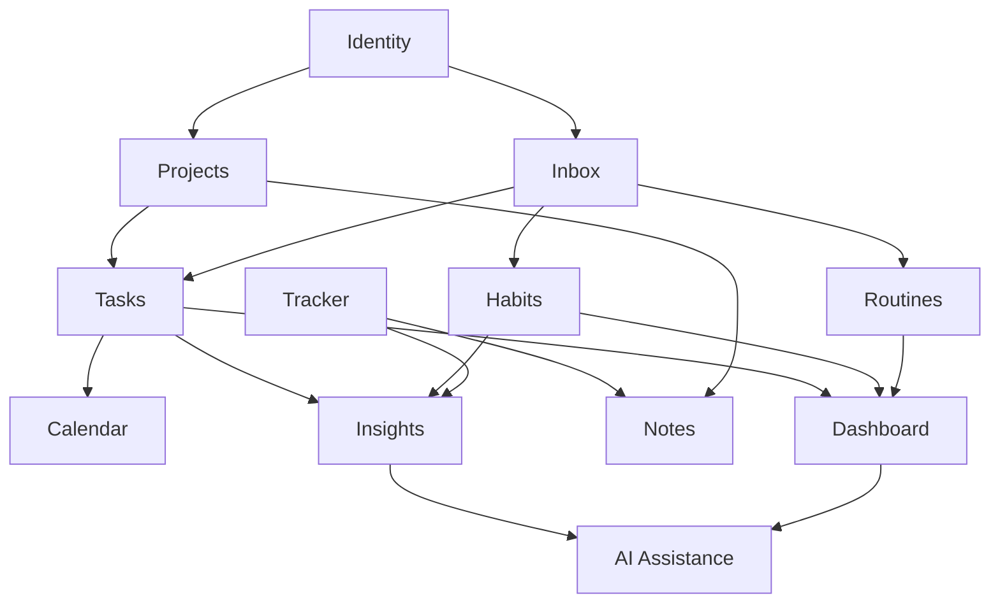

# TaskForge — Visão do Produto e Roadmap

> **English:** [PRODUCT_ROADMAP.md](PRODUCT_ROADMAP.md)

---

## 1. Propósito do produto

O TaskForge é uma **plataforma pessoal de organização modular** criada para centralizar demandas cotidianas com baixo atrito e reduzir a carga mental associada à manutenção de um sistema de produtividade.

**Não** é uma ferramenta genérica que exige configuração constante. A proposta central:

> flexibilidade suficiente para acompanhar a vida real, mas estrutura suficiente para não exigir manutenção manual excessiva.

Com o tempo, deve evoluir para um **sistema operacional pessoal para organização cotidiana**.

---

## 2. Princípios

### 2.1 Baixa fricção

Criar uma tarefa, registrar um hábito ou adicionar uma informação deve exigir poucos segundos.

Exemplo futuro:

```text
Ctrl + K
→ digitar "comprar areia dos gatos"
→ Enter
```

A demanda entra na caixa de entrada e pode ser categorizada posteriormente.

### 2.2 Capturar primeiro, organizar depois

A captura rápida não deve exigir escolha imediata de projeto, prioridade, prazo, categoria, tags, nível de energia ou duração estimada. **Somente o título é obrigatório.**

### 2.3 Uma informação cadastrada uma única vez

Uma tarefa com prazo deve aparecer automaticamente no projeto, na lista geral, no calendário, na tela "Hoje" e em listas de atraso — sem duplicação manual.

### 2.4 Progresso visual satisfatório

O sistema deve aproveitar a satisfação de listas e checklists. Itens concluídos permanecem visualmente identificáveis e alimentam indicadores simples de progresso.

### 2.5 Uso possível em dias de baixa energia

Visualizações futuras reduzidas destacarão o essencial, tarefas rápidas, rotinas mínimas, itens compatíveis com o tempo disponível e com baixa energia.

### 2.6 Histórico preservado

Mesmo antes dos módulos analíticos, o backend deve preservar timestamps e dados históricos relevantes desde o início para análises futuras de padrões pessoais.

---

## 3. Abordagem de monólito modular

O TaskForge será inicialmente desenvolvido como um **monólito modular**:

- uma aplicação, um deploy, um banco de dados inicialmente;
- módulos separados por responsabilidade;
- baixo acoplamento entre áreas do sistema;
- evolução incremental;
- complexidade operacional menor do que microsserviços.

Microsserviços **não** são objetivo atual. A separação modular permite que domínios evoluam sem complexidade distribuída prematura.

### Estrutura conceitual futura

```text
TaskForge
├── Identity
├── Projects
├── Tasks
├── Inbox
├── Habits
├── Routines
├── Tracker
├── Lists
├── Calendar
├── Notes
├── Dashboard
├── Insights
└── AI Assistance
```

### Estrutura física atual do repositório

```text
TaskForge/
├── TaskForge.Domain/
├── TaskForge.Application/
├── TaskForge.Infrastructure/
├── TaskForge.Api/
├── TaskForge.Tests/
├── docs/
├── Dockerfile
├── docker-compose.yml
└── .env.example
```

Apenas **Identity** (em Infrastructure), **Projects** e infraestrutura parcial existem no código hoje. Módulos futuros ainda não possuem pastas de implementação.

---

## 4. Módulos previstos

### 4.1 Identity

| Campo | Detalhe |
|-------|---------|
| **Objetivo** | Gerenciar identidade, autenticação e isolamento dos dados pessoais |
| **Responsabilidades** | Cadastro, login, JWT, identificação do usuário atual, autorização por propriedade, preferências futuras |
| **Exemplos** | Registrar com e-mail, login, acessar endpoints protegidos com Bearer token |
| **Relações** | Base de todos os módulos; todo recurso pertence a um usuário |
| **MVP atual** | Incluído |
| **Status de implementação** | Parcialmente implementado — auth funciona; ownership não aplicado nos handlers |
| **Dados para análises futuras** | Timestamps de login, padrões de sessão (quando rastreados) |

---

### 4.2 Projects

| Campo | Detalhe |
|-------|---------|
| **Objetivo** | Contêineres para esforços organizacionais maiores |
| **Exemplos** | "Candidatura SENAI", "TaskForge", "Organização da casa", "Estudos" |
| **Responsabilidades** | CRUD, arquivar, excluir, organizar tarefas, associar notas/links, acompanhar progresso, habilitar módulos |
| **Relações** | Pai de Tasks; vinculado por Notes, Dashboard, Insights |
| **MVP atual** | Incluído |
| **Status de implementação** | Parcialmente implementado — CRUD sem `OwnerId` nem escopo por usuário |
| **Dados para análises futuras** | Timestamps de criação/atualização, tempo parado, taxas de conclusão |

---

### 4.3 Tasks

| Campo | Detalhe |
|-------|---------|
| **Objetivo** | Gerenciar ações pontuais que precisam ser concluídas |
| **Exemplos** | "Comprar resistência do chuveiro", "Finalizar README", "Enviar documentação" |
| **Responsabilidades** | Criar, atualizar, status, prioridade, prazo, concluir, reabrir, excluir, vincular a projeto, registrar timestamps |
| **Relações** | Filho de Projects; alimenta Calendar, Dashboard, Inbox (quando convertido), Insights |
| **MVP atual** | Incluído (escopo reduzido) |
| **Status de implementação** | Não iniciado |
| **Dados para análises futuras** | Transições de status, `CompletedAt`, aderência a prazos, distribuição de prioridade |

Campos futuros:

```text
TaskItem
├── Id, OwnerId, ProjectId?, Title, Description?
├── Status, Priority, DueDate?, EstimatedMinutes?, EnergyLevel?
├── CreatedAt, UpdatedAt?, CompletedAt?
```

---

### 4.4 Inbox

| Campo | Detalhe |
|-------|---------|
| **Objetivo** | Captura rápida sem categorização imediata |
| **Fluxo** | Adicionar rapidamente → armazenar na Inbox → organizar depois |
| **Ações posteriores** | Concluir, excluir, agendar, mover para projeto, converter em tarefa/hábito/rotina |
| **Relações** | Alimenta Projects, Tasks, Habits, Routines |
| **MVP atual** | Não incluído |
| **Status de implementação** | Planejado para versão futura (0%) |

---

### 4.5 Habits

| Campo | Detalhe |
|-------|---------|
| **Objetivo** | Acompanhar ações recorrentes com registro simples |
| **Exemplos** | Tomar remédio, estudar 20 minutos, caminhar, ir à academia |
| **Primeira versão futura** | Registro diário: Concluído / Pendente / Ignorado intencionalmente |
| **Evoluções** | Quantidade, duração, histórico mensal, consistência, calendário, streaks não punitivos, modo dia mínimo |
| **Relações** | Dashboard, Calendar, Insights |
| **MVP atual** | Não incluído |
| **Status de implementação** | Planejado para versão futura (0%) |

---

### 4.6 Routines

| Campo | Detalhe |
|-------|---------|
| **Objetivo** | Checklists reutilizáveis para iniciar ou concluir sequências |
| **Exemplos** | Rotina "sair para a academia"; rotina "iniciar expediente" |
| **Relações** | Dashboard, Habits, Insights |
| **MVP atual** | Não incluído |
| **Status de implementação** | Planejado para versão futura (0%) |

---

### 4.7 Tracker

| Campo | Detalhe |
|-------|---------|
| **Objetivo** | Acompanhar livros, cursos, séries, filmes, jogos, desafios e interesses de longo prazo |
| **Tipos** | Book, Course, Series, Movie, Game, Podcast, Activity, Challenge, Article, Other |
| **Status** | Backlog, InProgress, Paused, Completed, Dropped |
| **Relações** | Notes, Dashboard, Insights |
| **MVP atual** | Não incluído |
| **Status de implementação** | Planejado para versão futura (0%) |

---

### 4.8 Lists

| Campo | Detalhe |
|-------|---------|
| **Objetivo** | Listas livres e rápidas sem estrutura completa de tarefa |
| **Exemplos** | Lista de compras, filmes para assistir, ideias para o TaskForge |
| **MVP atual** | Não incluído |
| **Status de implementação** | Planejado para versão futura (0%) |

---

### 4.9 Calendar

| Campo | Detalhe |
|-------|---------|
| **Objetivo** | Consolidar automaticamente informações temporais |
| **Responsabilidades** | Tarefas com prazo, eventos, sessões, recorrências, visualização semanal |
| **MVP atual** | Não incluído |
| **Status de implementação** | Planejado para versão futura (0%) |

---

### 4.10 Notes

| Campo | Detalhe |
|-------|---------|
| **Objetivo** | Anotações simples relacionadas a projetos e outros recursos |
| **Primeira versão futura** | Markdown, links, vínculo com projetos e Tracker |
| **MVP atual** | Não incluído |
| **Status de implementação** | Planejado para versão futura (0%) |

---

### 4.11 Dashboard

| Campo | Detalhe |
|-------|---------|
| **Objetivo** | Consolidar o que importa no dia atual |
| **Exemplo** | Tela "Hoje" com hábitos, tarefas importantes, tarefas rápidas e progresso |
| **MVP atual** | Não incluído |
| **Status de implementação** | Planejado para versão futura (0%) |

---

### 4.12 Insights

| Campo | Detalhe |
|-------|---------|
| **Objetivo** | Utilizar dados registrados para compreender padrões pessoais — não apenas produtividade |
| **Perguntas futuras** | Energia por dia da semana, sono vs tarefas, exercício vs foco, projetos parados, adiamentos, rotinas úteis, abandonos de cursos |
| **Fontes de dados** | Tarefas, datas, prazos, hábitos, rotinas, sessões, conteúdos, conclusões, abandonos |
| **MVP atual** | Não incluído |
| **Status de implementação** | Planejado para versão futura (0%) |

---

### 4.13 AI Assistance

| Campo | Detalhe |
|-------|---------|
| **Objetivo** | Apoio opcional, transparente e controlado pelo usuário |
| **Possibilidades** | Priorização, resumo de pendências, padrões, divisão de tarefas, organização da Inbox, planejamento por energia/tempo |
| **Princípio** | A IA apoia decisões; não retira controle do usuário |
| **MVP atual** | Não incluído |
| **Status de implementação** | Planejado para versão futura (0%) |

---

## 5. Relações entre módulos



Identity sustenta todos os módulos. Tasks e Habits alimentam Dashboard e Calendar. Insights consome histórico de múltiplos módulos. AI Assistance vem por último, com dados consolidados.

---

## 6. Roadmap recomendado

```text
MVP backend
→ Habits
→ Inbox
→ Dashboard Today
→ Tracker
→ Routines
→ Calendar
→ Lists
→ Notes
→ Frontend visual
→ Insights
→ AI Assistance
```

| Fase | Lógica |
|------|--------|
| **MVP backend** | Fundação técnica: auth, ownership, projetos, tarefas |
| **Habits** | Valor cotidiano com custo relativamente baixo |
| **Inbox** | Reduz atrito de captura — princípio central do produto |
| **Dashboard Today** | Consolida execução diária |
| **Tracker** | Incorpora leituras, estudos e atividades de longo prazo |
| **Routines** | Ajuda a iniciar sequências de atividades |
| **Calendar** | Organiza dimensão temporal |
| **Lists** | Atende casos simples sem overhead de tarefa completa |
| **Notes** | Amplia contexto de projetos e itens rastreados |
| **Frontend visual** | Transforma o backend em ferramenta utilizável no dia a dia |
| **Insights** | Utiliza histórico acumulado |
| **AI Assistance** | Atua sobre dados consolidados, com controle do usuário |

---

## 7. Tabela resumo de status

| Módulo | No MVP atual | Status | Progresso | Observações |
|--------|--------------|--------|-----------|-------------|
| Identity | Sim | Parcialmente implementado | 75% | Auth completo; wiring de ownership pendente |
| Projects | Sim | Parcialmente implementado | 58% | CRUD feito; sem `OwnerId` nem escopo |
| Tasks | Sim | Planejado para o MVP atual | 0% | Não iniciado no código |
| Inbox | Não | Planejado para versão futura | 0% | — |
| Habits | Não | Planejado para versão futura | 0% | — |
| Routines | Não | Planejado para versão futura | 0% | — |
| Tracker | Não | Planejado para versão futura | 0% | — |
| Lists | Não | Planejado para versão futura | 0% | — |
| Calendar | Não | Planejado para versão futura | 0% | — |
| Notes | Não | Planejado para versão futura | 0% | — |
| Dashboard | Não | Planejado para versão futura | 0% | — |
| Insights | Não | Planejado para versão futura | 0% | — |
| AI Assistance | Não | Planejado para versão futura | 0% | — |

**MVP backend geral (Identity + Projects + Tasks + infraestrutura): 53%**

Consulte [Status de Implementação](IMPLEMENTATION_STATUS.pt-BR.md) para tabelas completas item a item.

---

## 8. Decisões de escopo

| Decisão | Justificativa |
|---------|---------------|
| Monólito modular primeiro | Iteração mais rápida, deploy único, menor carga operacional para plataforma pessoal |
| MVP = 3 módulos | Provar auth, ownership e padrões CRUD antes de expandir |
| Tarefas aninhadas em projetos | Modelo mental natural; autorização flui pela propriedade do projeto |
| Timestamps históricos desde o início | Permite Insights futuro sem lacunas de dados |
| Sem microsserviços | Prematuro para escala e tamanho atual do projeto |
| Sem frontend no MVP | Backend deve ser sólido e testável primeiro |
| IA por último | Requer dados consolidados e limites claros de confiança |

---

## 9. Explicitamente fora do MVP atual

Frontend, Inbox, hábitos, rotinas, Tracker, listas, calendário, notas, dashboard, insights, IA, colaboração entre usuários, convites, comentários, anexos, notificações, gamificação, microsserviços, refresh token, roles complexas, CI/CD completo e analytics avançado.

Esses itens aparecem **somente** no roadmap futuro acima.
